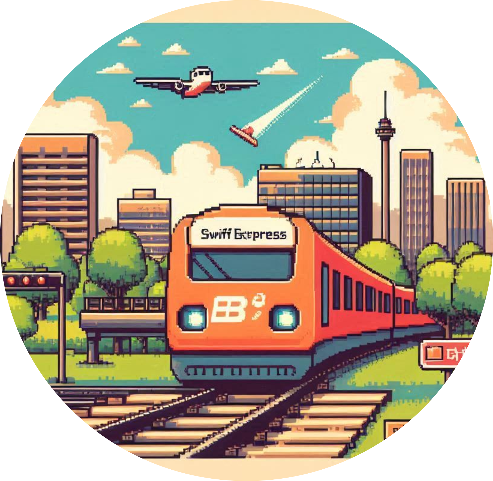

    preview do podcast

    <audio src="output/podcast_editado.MP3" controls title="Podcast editado"></audio>

# Projeto Podcast Gerado por I.A.s

 > ℹ️ **NOTE:** Este é o repositório desenvolvido durante uma live no Youtube em parceria com a [DIO](https://dio.me)

Projeto com o objetivo de gerar um podcast utilizando ferramentas de IA através de prompts mais trabalhado.

Utilizer uma esteira de prompts para gerar cada etapa do processo criativo.

# Projeto Podcast no NOTION

- Acesse o meu projeto [aqui](https://iron-curler-180.notion.site/Expresso-Swift-888c1883f8e5406cb353063fee28a7d2)

## 💻 Tecnologias utilizadas no projeto

- [ChatGPT](https://chat.openai.com/) 
- [DALL E 3](https://openart.ai/home?gad_source=1&gclid=Cj0KCQjwsPCyBhD4ARIsAPaaRf1UfJVxcRDFadqQnC5x22ZPgruPt2Ee_BxGXORsd0c_qRKztZuy0ZYaAscGEALw_wcB)
- [ElevenLabs](https://beta.elevenlabs.io/)
- [Capcut](https://www.capcut.com/pt-br/)

## ✨ Como foi feito ?

- Roteiro gerado via chatgpt
- Audio gerado pela elevenLabs
- DALL E 3 Para gerar capas
- Capcut para tratar aúdio e adicionar sons de fundo

## 📚 Materiais

- [Notion Template](https://helpful-jump-17b.notion.site/PAS-Podcast-AI-Studio-210489e15d7a4a73b743bb159e45d06f?pvs=4)
- [Editor de aúdio](https://www.capcut.com/editor?from_page=landing_page&__action_from=picture_V%C3%ADdeos%20profissionais%20em%20minutos,%20n%C3%A3o%20em%20horas.)

## 🛠️ Instruções de execução

Utilize os prompts dentro do link do `Notion` fornecido na parte de `Materiais` para criar um podcast de maneira automatizada, para isso siga o passo a passo abaixo.

- 🤖 1. Use os prompts de roteiro no `chagpt`
- 🤖 2. Use os prompts de roteiro gerados pelo chatgpt no  `ElevenLabs`
- 🤖 3. Use os prompts de artes no `DALL E 3`

## 👨‍💻 Student

    
    
&nbsp&nbsp&nbsprluispev 
    &nbsp&nbsp&nbsp
    <a 
        href="https://github.com/rluispdev">
        GitHub
    </a>
    &nbsp;|&nbsp;
    <a 
        href="https://www.linkedin.com/in/rafael-luis-gonzaga-b11634186/">
        LinkedIn
    </a>
    &nbsp;|&nbsp;
    <a 
        href="https://www.instagram.com/rluispdevs?igsh=cnoxenpmaHY1amE0&utm_source=qr">
        Instagram
    </a>
    &nbsp;|&nbsp;

  

---

⌨️ READ/Projeto desenvolvido por [Felipe Aguiar](https://github.com/felipeAguiarCode)
